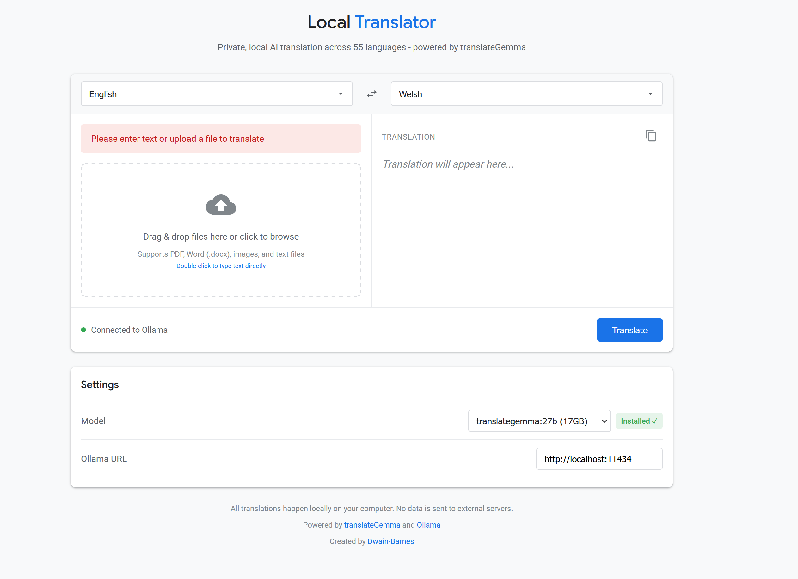

# Local Translator


****

A private, local AI-powered translation application that runs entirely on your computer. Translate text, documents, and images across 55 languages without sending any data to external servers.

## ✨ Features

- 🔒 **100% Private & Local** - All translations happen on your computer, no data sent to external servers
- 🌍 **55 Languages** - Support for major world languages including English, Welsh, Spanish, French, German, Chinese, Japanese, Arabic, and more
- 📄 **Multiple File Formats**
  - Text files (.txt)
  - PDF documents (.pdf)
  - Word documents (.docx)
  - Images (.png, .jpg, .jpeg, .gif, .webp) - Extract and translate text from images
- 🎯 **Easy to Use** - Simple drag-and-drop interface
- ⚡ **Fast** - Powered by local AI models (no internet required after setup)
- 🎨 **Clean UI** - Google-inspired design with dark/light mode support

## 🚀 Quick Start

### Prerequisites

1. **Install Ollama** - [Download from ollama.com](https://ollama.com)
2. **Download translateGemma Model**
   ```bash
   ollama pull translategemma:27b
   ```
   Or use smaller models:
   - `ollama pull translategemma` (4B - 3.3GB)
   - `ollama pull translategemma:12b` (8.1GB)
3. **Allow the page to talk to Ollama** - if you open the HTML file straight from disk (a `file://` address), Ollama's default CORS settings will block it. Set `OLLAMA_ORIGINS` and restart Ollama:
   - **Windows**: run `setx OLLAMA_ORIGINS "*"` then restart the Ollama app
   - **macOS**: run `launchctl setenv OLLAMA_ORIGINS "*"` then restart Ollama
   - **Linux**: start Ollama with `OLLAMA_ORIGINS="*" ollama serve`

   Don't want to change Ollama's settings? Serving the file from a local webserver works too: run `python -m http.server` in the folder containing the file and open `http://localhost:8000/local-translator.html`.

### Usage

1. **Download** the `local-translator.html` file
2. **Open** it in your web browser (Chrome, Firefox, Edge, etc.) - if the status bar says it can't connect, see Prerequisites step 3 above
3. **Upload** a file or type text directly
4. **Select** source and target languages
5. **Click** "Translate"

That's it! No installation, no setup, just open and use.

## 📋 Supported Languages

English, Afrikaans, Arabic, Bulgarian, Bengali, Catalan, Czech, Welsh, Danish, German, Greek, Spanish, Estonian, Persian, Finnish, French, Irish, Scottish Gaelic, Galician, Gujarati, Hebrew, Hindi, Croatian, Hungarian, Indonesian, Italian, Japanese, Kannada, Korean, Lithuanian, Latvian, Macedonian, Malayalam, Marathi, Malay, Maltese, Dutch, Norwegian, Polish, Portuguese, Romanian, Russian, Slovak, Slovenian, Albanian, Serbian, Swedish, Swahili, Tamil, Telugu, Thai, Turkish, Ukrainian, Urdu, Vietnamese, Chinese (Simplified), Chinese (Traditional)

## 🖼️ Screenshots

### Main Interface
Clean, intuitive interface with drag-and-drop file support

### Translation in Action
Real-time translation with support for multiple file formats

### Settings
Choose between different model sizes based on your needs

## 💡 How It Works

1. **Local AI Processing** - Uses Google's translateGemma model via Ollama
2. **No Internet Required** - After downloading the model, everything runs offline
3. **Privacy First** - Your documents and text never leave your computer
4. **Smart Extraction** - Automatically extracts text from PDFs, Word docs, and images

## 🛠️ Technical Details

### Architecture
- **Frontend**: Single HTML file with vanilla JavaScript
- **AI Engine**: Ollama (local LLM runtime)
- **Model**: Google's translateGemma (4B/12B/27B variants)
- **APIs Used**: Ollama REST API

### File Processing
- **PDF**: pdf.js for text extraction
- **Word**: mammoth.js for .docx parsing
- **Images**: Base64 encoding with vision-enabled translation

### Model Options
| Model | Size | RAM Required | Speed | Quality |
|-------|------|--------------|-------|---------|
| translategemma | 3.3GB | 8GB | Fast | Good |
| translategemma:12b | 8.1GB | 16GB | Medium | Better |
| translategemma:27b | 17GB | 32GB | Slower | Best |

## 🔧 Configuration

The application auto-detects Ollama running on `http://localhost:11434`. If you're running Ollama on a different port or host, you can change it in the Settings section.

## 🎯 Use Cases

- **Document Translation** - Translate research papers, reports, and documents
- **Learning Languages** - Practice translations and compare results
- **Privacy-Sensitive Content** - Translate confidential documents without cloud services
- **Offline Translation** - Work without internet connectivity
- **Batch Processing** - Translate multiple files quickly
- **Image Text Translation** - Extract and translate text from screenshots, photos, signs, etc.

## 🚨 Troubleshooting

### "Cannot connect to Ollama. Is it running?"
- **Most common cause**: the page was opened directly from disk (`file://`), so the browser blocks requests to Ollama (CORS). Set `OLLAMA_ORIGINS="*"` and restart Ollama - see Prerequisites step 3 above
- Make sure Ollama is installed and running
- Check that Ollama is accessible at `http://localhost:11434`
- Try running `ollama serve` in your terminal

### PDF Uploads But Nothing Translates
Scanned PDFs (photocopies, faxes, phone scans) usually have no text layer, so there is no text to extract. The app detects this and translates each page as an image instead, using the model's vision support - the input box will say "Scanned PDF detected". To keep memory use in check, only the first 20 pages of a scanned PDF are translated.

### Model Not Installed
- The application will show a "Download" button
- Click it to automatically download the selected model
- Or manually run: `ollama pull translategemma:27b`

### Translation Quality Issues
- Try using a larger model (27B > 12B > 4B)
- Ensure your source language is correctly selected
- For better results, use clear, well-formatted text

### Image Translation Not Working
- Ensure you're using a vision-capable model (all translateGemma models support this)
- Check that the image text is clear and readable
- Try with higher resolution images

## 🤝 Contributing

Contributions are welcome! Feel free to:
- Report bugs
- Suggest new features
- Submit pull requests
- Improve documentation

## 📜 License

This project uses:
- **translateGemma** - [Gemma Terms of Use](https://ai.google.dev/gemma/terms)
- **Ollama** - [Apache 2.0 License](https://github.com/ollama/ollama/blob/main/LICENSE)

## 🙏 Acknowledgments

- **Google** for the translateGemma model
- **Ollama** for the local LLM runtime
- **pdf.js** and **mammoth.js** for document processing

## 📞 Contact

Created by [Dwain-Barnes](https://github.com/Dwain-Barnes)

---

**Note**: This is a local-only application. No telemetry, no tracking, no cloud services. Your privacy is guaranteed.

## ⭐ Star This Project

If you find this useful, please give it a star on GitHub!
